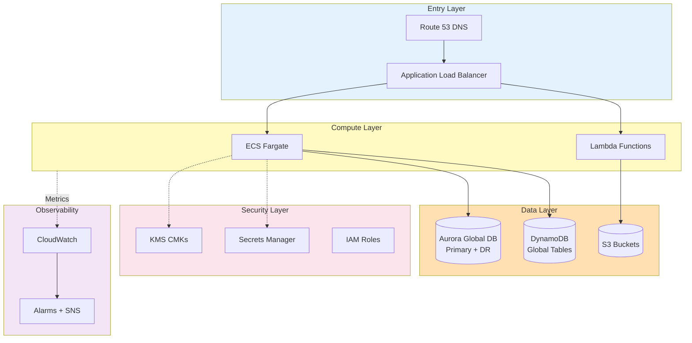

# InfraTales | Multi-Region DR on AWS with CDK: Hitting 15-Minute RPO for a Financial Services Workload

**Production-ready AWS AWS CDK TYPESCRIPT reference architecture — platform pillar**

> A financial services platform processing 10,000 transactions/hour needs a DR setup with a 15-minute RPO and 30-minute RTO — requirements that most 'backup to S3 and pray' DR strategies fail catastrophically against. The compliance pressure means you cannot cut corners on encryption, audit trails, or data residency, and a single-region Aurora outage at 2 AM is not a theoretical risk but an eventual certainty. The real pain is that most teams only discover their DR plan doesn't actually meet RTO/RPO commitments during an actual incident.

[](LICENSE)
[](CONTRIBUTING.md)
[](https://aws.amazon.com/)
[](https://aws.amazon.com/cdk/)
[](https://infratales.com)
[](https://infratales.com)

## 📋 Table of Contents

- [Overview](#-overview)
- [Architecture](#-architecture)
- [Key Design Decisions](#-key-design-decisions)
- [Getting Started](#-getting-started)
- [Deployment](#-deployment)
- [Docs](#-docs)
- [Full Guide](#-full-guide-on-infratales)
- [License](#-license)

---

## 🎯 Overview

The design spans two AWS regions (us-east-2 primary, us-east-1 DR) using Aurora Global Database for sub-second cross-region replication as the backbone of the RPO guarantee [from-code]. Application traffic is distributed via ALBs fronting ECS Fargate services inside multi-AZ VPCs, with Route 53 health checks presumably driving automated DNS failover [inferred]. DynamoDB Global Tables handle session state so that a regional failover doesn't invalidate active user sessions — a detail most DR designs miss [from-code]. All data at rest is encrypted via KMS customer-managed keys, with Secrets Manager for credential storage and CloudWatch for cross-region observability [from-code].

### Pillar
**PLATFORM** — part of the InfraTales AWS Reference Architecture series.

### Target Audience
This reference is written for **staff-level** cloud and DevOps engineers building production AWS infrastructure.

---

## 🏗️ Architecture



---

## 🔑 Key Design Decisions

- Aurora Global Database cross-region replication adds roughly $300-500/month in replication I/O and DR cluster costs, but it's what compresses RPO from hours (snapshot restore) to under a minute [inferred]
- ECS Fargate in the DR region kept warm (even at minimum capacity) burns compute budget 24/7 for a failure scenario you hope never triggers — cold-start ECS in DR during an incident almost certainly blows your 30-minute RTO [editorial]
- DynamoDB Global Tables replicate every write to both regions, doubling your DynamoDB write costs, but the alternative is losing session state on failover and forcing 10,000 tx/hr worth of users to re-authenticate mid-transaction [inferred]
- KMS CMKs are region-scoped, so you need separate key management in each region with cross-region key policies — adds IAM and key rotation operational overhead but is non-negotiable for financial compliance [from-code]
- Route 53 health-check-based DNS failover has a minimum TTL floor and health check evaluation period that makes sub-5-minute RTO via DNS alone unrealistic — this architecture's 30-minute RTO is achievable but tight [editorial]

> For the full reasoning behind each decision, including cost models, alternatives considered, and what breaks at scale — see the **[Full Guide on InfraTales](https://infratales.com)**.

---

## 🚀 Getting Started

### Prerequisites

```bash
node >= 18
npm >= 9
aws-cdk >= 2.x
AWS CLI configured with appropriate permissions
```

### Install

```bash
git clone https://github.com/InfraTales/$(basename $(pwd)).git
cd $(basename $(pwd))
npm install
```

### Bootstrap (first time)

```bash
cdk bootstrap aws://ACCOUNT_ID/REGION
```

---

## 📦 Deployment

```bash
# Deploy to dev
cdk deploy --context env=dev

# Deploy to production
cdk deploy --context env=prod --require-approval broadening
```

> ⚠️ Review all IAM permissions before deploying to production.

---

## 📂 Docs

| Document | Description |
|---|---|
| [Architecture](docs/architecture.md) | System design and component overview |
| [Runbook](docs/runbook.md) | Operational runbook for on-call engineers |
| [Cost Model](docs/cost.md) | Cost breakdown by component and environment |
| [Security](docs/security.md) | Security controls and compliance notes |

---

## 📖 Full Guide on InfraTales

This repo contains the **sanitized reference code**. The full production guide on [InfraTales](https://infratales.com) covers:

- Complete AWS CDK TYPESCRIPT stack walkthrough with annotated code
- Step-by-step deployment sequence
- Edge cases and failure modes (what breaks in production)
- Cost breakdown by component
- Alternatives considered and why they were ruled out
- Post-deploy validation checklist

**→ [Read the Full Guide](https://infratales.com)**

---

## 🤝 Contributing

See [CONTRIBUTING.md](CONTRIBUTING.md) for guidelines.

## 🔒 Security

See [SECURITY.md](SECURITY.md) for our security policy and how to report vulnerabilities.

## 📄 License

See [LICENSE](LICENSE) for terms. Source code is provided for reference and learning purposes.

---

<p align="center">
  Built with ❤️ by <a href="https://infratales.com">InfraTales</a> — Production AWS Reference Architectures
</p>
